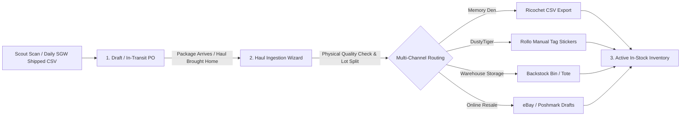
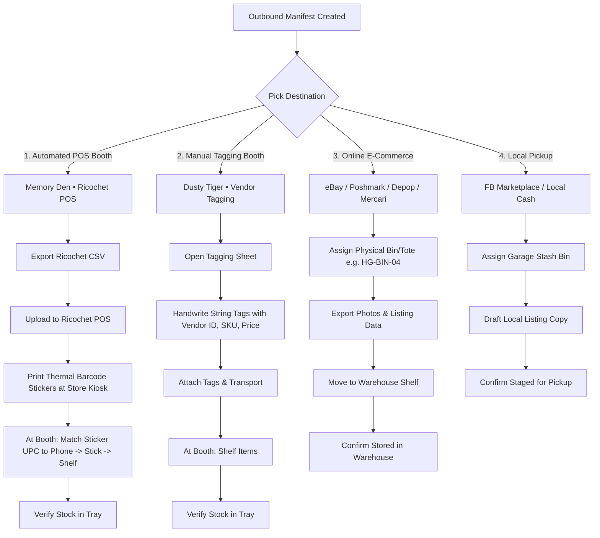

# Haul Ingestion & Multi-Channel Sourcing SOP

## 1. User Sourcing Channels & Sourcing Persona
1. **In-Person Thrift Runs (Goodwill, Estate Sales, Garage Sales)**:
   - Sourced via live camera receipt OCR in **Speed Entry** (`/purchases/speed-entry`).
   - Generates a Purchase Order with raw line items and costs.
2. **Daily Online Auction Shipments (ShopGoodwill, eBay, HiBid)**:
   - Imported via daily **Shipped Report CSVs** into Purchase Orders (`status: 'ordered'` or `'in-transit'`).
   - Tracks tracking numbers, purchase dates, and landed shipping/handling allocations.
3. **Co-Op & Shared Booth Operations (PDXGL "Portland Gaming Library")**:
   - Manages personal inventory alongside shared booth co-founders (e.g. PDXGL) with segregated inventory ownership and partner consignment reconciliation.

---

## 2. The 4-Stage ERP Lifecycle (Zero Inventory Clutter)

### Stage Rules:
- **Rule 1: Never Clutter Active Inventory**: Items in `draft`, `ordered`, or `in-transit` status must **NEVER** appear in the main active inventory table. They reside exclusively in **Purchases** (`/purchases`).
- **Rule 2: Pre-Arrival Intelligence**: While an online auction order is in-transit, Gemini AI pre-identifies items from the auction photos, pre-calculates target margins, and drafts 30–42 character tag titles.
- **Rule 3: Unboxing Verification & Lot Splitting**:
  - When the physical box arrives, the user opens the **Haul Ingestion Wizard**.
  - High-ticket "grail" items are split out as individual single SKUs ($35–$150+).
  - Mid-tier runs are combined into multi-quantity SKUs ($12–$25/ea).
  - Common/filler copies are bundled into grab-bags or floor bins ($4–$8/ea).
- **Rule 4: Multi-Channel Destination Routing**:
  1. **Memory Den**: Exports 1-Click **Ricochet POS CSV** (`SKU, Item Title, Description, Price, Quantity, Category, Brand`) to upload and print in Ricochet POS.
  2. **DustyTiger**: Prints direct **Rollo Thermal Stickers** (`DUSTY`, Title, Price, SKU) to stick directly onto DustyTiger's manual cardstock tags.
  3. **Backstock Storage**: Assigns physical storage bin/tote (e.g. *Bin A1, Tote 4*) for items waiting for booth shelf space.
  4. **Online Marketplaces (eBay/Poshmark)**: Generates 80-char SEO titles, condition notes, keywords, and market comps.

---

## 3. Physical Thermal Label & Tag Standards (Rollo & Ricochet)
- **Memory Den Tag Titles**: Strictly 30–42 characters max for thermal price tag compatibility:
  - *Vintage Magazines*: `Heavy Metal Mag - Oct 1977 #7`
  - *Vintage Apparel*: `Carhartt Detroit Jacket (L)`
  - *Toys/Figures*: `Kenner Star Wars Boba Fett 1979`
  - *Music/Media*: `Def Leppard Rock of Ages (2-CD)`
- **Multi-Disc Sets**: A 2-CD or double LP set is **1 single inventory SKU**, not 2 separate items.

---

## 4. Outbound Manifest & Destination Routing SOP

When inventory is ready to leave the workbench/staging area, it is grouped into an **Outbound Manifest**. The operational workflow adapts strictly to the destination archetype:

### The 4 Destination Archetypes:

---

## 5. The In-Store "Sticker & Shelf" Physical Protocol (Memory Den)

Because thermal barcode label printers are located on-site at the consignment mall (not at the home garage), the in-store stocking flow follows a strict physical sequence:

1. **Pre-Arrival (Home/Office)**:
   - Items staged into a destination drop manifest in Resale Command.
   - 1-Click Ricochet CSV exported and imported into Ricochet POS.
   - Items packed into tote bins and driven to the store.
2. **Kiosk Check-In (Front Desk)**:
   - User accesses the shop's thermal label printer and prints the freshly imported batch of adhesive barcode stickers.
   - User enters their booth holding a printed strip/sheet of thermal stickers and the un-stickered items.
3. **Booth Stocking & Verification (Phone UI)**:
   - User opens Resale Command on mobile and slides open the **Manifest Tray**.
   - **Visual & SKU Matching**: The Tray highlights the **UPC / SKU** in high-contrast bold font alongside the photo thumbnail and retail price.
   - **Stick & Shelf**: User matches the sticker barcode to the phone screen, sticks it onto the physical item, and places it onto the shelf.
   - **One-Tap Checkoff**: User taps the item row to mark it verified (turns green/struck through).
   - **Mid-Stock Adjustments**: If a flaw or chip is spotted on an item, tapping the edit icon opens the `ItemDrawer` to adjust the price or condition immediately.
   - **Commit**: Tapping **`Confirm Stocked`** marks all checked items as `status: 'placed'` at `storageLocation: 'MD'` and archives the manifest to history.
