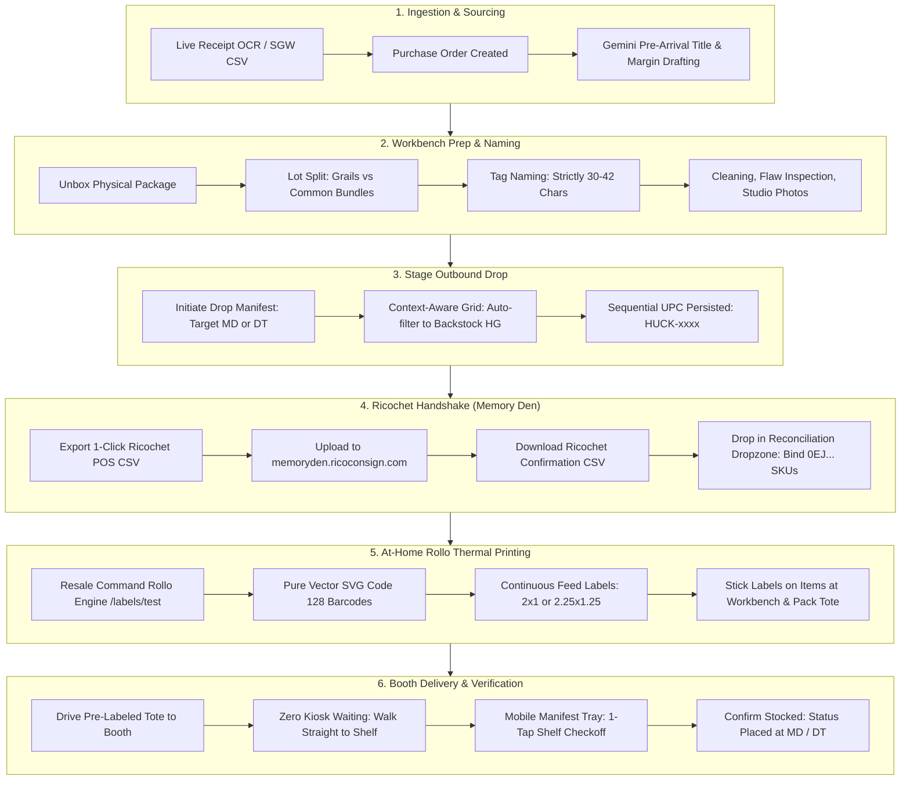

# Haul Ingestion & Multi-Channel Sourcing SOP

## 1. User Sourcing Channels & Sourcing Persona
1. **In-Person Thrift Runs (Goodwill, Estate Sales, Garage Sales)**:
   - Sourced via live camera receipt OCR in **Speed Entry** (`/purchases/speed-entry`).
   - Generates a Purchase Order with raw line items and costs.
2. **Daily Online Auction Shipments (ShopGoodwill, eBay, HiBid)**:
   - Imported via daily **Shipped Report CSVs** into Purchase Orders (`status: 'ordered'` or `'in-transit'`).
   - Tracks tracking numbers, purchase dates, and landed shipping/handling allocations.
3. **Co-Op & Shared Booth Operations (PDXGL "Portland Gaming Library")**:
   - Manages personal inventory alongside shared booth co-founders (e.g. PDXGL) with segregated inventory ownership and partner consignment reconciliation.

---

## 2. The 6-Stage Drop & Merchandising Lifecycle (Zero Kiosk Waiting)

```mermaid
flowchart TD
    subgraph Stage1["1. Ingestion & Sourcing"]
        A1[Live Receipt OCR / SGW CSV] --> A2[Purchase Order Created]
        A2 --> A3[Gemini Pre-Arrival Title & Margin Drafting]
    end

    subgraph Stage2["2. Workbench Prep & Naming"]
        B1[Unbox Physical Package] --> B2[Lot Split: Grails vs Common Bundles]
        B2 --> B3[Tag Naming: Strictly 30-42 Chars]
        B3 --> B4[Cleaning, Flaw Inspection, Studio Photos]
    end

    subgraph Stage3["3. Stage Outbound Drop"]
        C1[Initiate Drop Manifest: Target MD or DT]
        C1 --> C2[Context-Aware Grid: Auto-filter to Backstock HG]
        C2 --> C3[Sequential UPC Persisted: HUCK-xxxx]
    end

    subgraph Stage4["4. Ricochet Handshake (Memory Den)"]
        D1[Export 1-Click Ricochet POS CSV] --> D2[Upload to memoryden.ricoconsign.com]
        D2 --> D3[Download Ricochet Confirmation CSV]
        D3 --> D4[Drop in Reconciliation Dropzone: Bind 0EJ... SKUs]
    end

    subgraph Stage5["5. At-Home Rollo Thermal Printing"]
        E1[Resale Command Rollo Engine /labels/test]
        E1 --> E2[Pure Vector SVG Code 128 Barcodes]
        E2 --> E3[Continuous Feed Labels: 2x1 or 2.25x1.25]
        E3 --> E4[Stick Labels on Items at Workbench & Pack Tote]
    end

    subgraph Stage6["6. Booth Delivery & Verification"]
        F1[Drive Pre-Labeled Tote to Booth]
        F1 --> F2[Zero Kiosk Waiting: Walk Straight to Shelf]
        F2 --> F3[Mobile Manifest Tray: 1-Tap Shelf Checkoff]
        F3 --> F4[Confirm Stocked: Status Placed at MD / DT]
    end

    Stage1 --> Stage2 --> Stage3 --> Stage4 --> Stage5 --> Stage6
```

### Stage Invariants:
- **Rule 1: Never Clutter Active Inventory**: Items in `draft`, `ordered`, or `in-transit` status must **NEVER** appear in the main active inventory table. They reside exclusively in **Purchases** (`/purchases`).
- **Rule 2: Pre-Arrival Intelligence**: While an online auction order is in-transit, Gemini AI pre-identifies items from the auction photos, pre-calculates target margins, and drafts 30–42 character tag titles.
- **Rule 3: Unboxing Verification & Lot Splitting**:
  - When the physical box arrives, the user opens the **Haul Ingestion Wizard**.
  - High-ticket "grail" items are split out as individual single SKUs ($35–$150+).
  - Mid-tier runs are combined into multi-quantity SKUs ($12–$25/ea).
  - Common/filler copies are bundled into grab-bags or floor bins ($4–$8/ea).
- **Rule 4: Multi-Channel Destination Routing**:
  1. **Memory Den (`MD`)**: Full 6-Stage Drop lifecycle (Ricochet CSV $\rightarrow$ confirmation handshake $\rightarrow$ at-home Rollo labels $\rightarrow$ shelf placement).
  2. **DustyTiger (`DT`)**: Direct at-home Rollo thermal stickers (`DUSTY`, Title, Price, SKU) stuck onto cardstock hangtags $\rightarrow$ shelf placement.
  3. **Backstock Storage (`HG`)**: Assigns physical storage bin/tote (e.g. *Bin A1, Tote 4*) for items waiting for booth shelf space.
  4. **Online Marketplaces (eBay/Poshmark)**: Generates 80-char SEO titles, condition notes, keywords, and market comps.

---

## 3. Physical Thermal Label & Tag Standards (Rollo & Ricochet)
- **Tag Titles**: Strictly 30–42 characters max for thermal price tag compatibility without wrapping or truncation:
  - *Vintage Magazines*: `Heavy Metal Mag - Oct 1977 #7`
  - *Vintage Apparel*: `Carhartt Detroit Jacket (L)`
  - *Toys/Figures*: `Kenner Star Wars Boba Fett 1979`
  - *Music/Media*: `Def Leppard Rock of Ages (2-CD)`
- **Multi-Disc Sets**: A 2-CD or double LP set is **1 single inventory SKU**, not 2 separate items.
- **Label Anatomy**:
  - Top: Brand/Booth Identifier (`HUCK` or `DUSTY`) + Category
  - Middle: Bold 38-char Tag Title + Prominent Retail Price (`$xx.00`)
  - Bottom: Sharp Vector SVG Code 128 Barcode + Human-Readable Barcode Text (`HUCK-1488` / `0EJ993444`)

---

## 4. Drops vs. Casts: Logistics vs. Promotion Architectural Separation

Resale Command enforces a strict conceptual and operational boundary between moving physical items and marketing them:

| Dimension | 📦 Outbound Drop (`LocationManifestTray.vue`) | 🎬 Dropcast (`DropcastStagingTray.vue`) |
| :--- | :--- | :--- |
| **Domain** | **Physical Logistics & Operations** | **Creative Marketing & Social Broadcasting** |
| **Core Action** | Moves inventory from Garage (`HG`) to Booth (`MD`, `DT`) or Online. | Packages curated photos, AI copy, and hashtags for social media. |
| **Database Impact** | **Mutates Inventory State**: `in-stock` $\rightarrow$ `in-transit` $\rightarrow$ `placed`. Updates `storageLocation`. | **Read-Only / Media Only**: Never moves items or alters warehouse bins. |
| **Grid Auto-Filter** | Auto-filters main grid to **Unplaced Backstock** (`HG`, `status: 'in-stock'`). Hides placed/sold items. | Auto-filters to **Photo-Ready Stock** (`imageId != null`), highlighting fresh booth drops or hero grails. |
| **Primary Output** | Ricochet CSV, Reconciliation Handshake, At-Home Rollo Thermal Print Strip. | Live Phone Simulator Preview, 1-Click Copy Caption, 1-Click ZIP Download of Photos. |

---

## 5. The At-Home Rollo Printing & Ricochet Handshake Protocol

### Why the Handshake Order-of-Operations is Non-Negotiable:
If you print Memory Den tags *before* Ricochet knows about them, the physical tag may contain an unmapped barcode or internal SKU. When a customer brings the item to the Memory Den front register, Ricochet's scanner will beep `"Item Not Found"`.

**The Correct Sequence:**
1. **Stage Drop in Resale Command**: Group garage backstock items into the manifest. Resale Command ensures every item has a permanent sequential `HUCK-xxxx` UPC in Appwrite.
2. **Export Ricochet CSV**: 1-click export from the Manifest Tray.
3. **Upload to Ricochet**: Log into `memoryden.ricoconsign.com`, upload the CSV. Ricochet creates the items and assigns official internal store SKUs (e.g. `0EJ993444`).
4. **Download Ricochet Confirmation & Drop in Resale Command**:
   - Resale Command reconciles records by `HUCK-xxxx` UPC or normalized Title + Price.
   - Saves `locationSku` to both the Appwrite item and manifest snapshot.
   - Both `HUCK-xxxx` and `0EJ...` are now synchronized.
5. **Print at Home on Rollo Printer**:
   - Open Resale Command's Thermal Label Print Studio (`/labels/test` or manifest print action).
   - Generates exact continuous-feed Code 128 thermal labels on Mac or PC.
   - Thermal label encodes `0EJ...` (or `HUCK-xxxx`), guaranteed to scan at the Memory Den register.
6. **Stick Tags at Home Workbench & Pack**:
   - Apply labels directly onto items or hangtags at home.
   - Pack items into transport totes.
7. **Deliver to Booth (Zero Kiosk Waiting!)**:
   - Drive to Memory Den. Walk right past the front desk kiosk line.
   - Place items directly on shelves.
   - Open mobile Manifest Tray on phone, 1-tap checkoff as items hit the shelf.
   - Tap `Confirm Stocked` to set items to `status: 'placed'` at `storageLocation: 'MD'`.

### Custom & One-Off Items (Handmade Hats, Non-Standard Goods):
- For custom/handmade items (e.g. altered hats, custom vintage combines) where automated CSV title matching might differ:
  - Resale Command's reconciliation engine uses a **Fuzzy Title + Price Matcher** with user confirmation.
  - If Ricochet assigns an unexpected SKU, the user can manually paste or scan the Ricochet SKU directly into the item row in the Manifest Tray to lock the match.
  - Once matched, print the thermal tag with full confidence.

---

## 6. Single True UPC Authority & Anti-Desync Invariants

To permanently eliminate barcode desynchronization, duplicate tag collisions, and missing UPCs:

### A. The Single Source of Truth (`src/lib/upcAuthority.ts`)
- **Strict Invariant: Zero Ghost Barcodes**:
  - The CSV exporter, lot splitter, and haul wizards must **never** slice arbitrary characters from Appwrite document IDs or invent unpersisted barcodes.
  - Every exported or printed barcode must exist as a persisted `upc` attribute in Appwrite `resale_db.items`.
  - When an export is initiated in `useManifest.ts`, `ensureItemUpc()` scans all staged items and writes true canonical sequential UPCs to any unassigned items in the database before generating the CSV.
- **Prefix Isolation & True Database Max**:
  - Barcodes follow strict org prefixes (e.g., `HUCK-` for Memory Den booth items, `PDX-` for Portland Gaming Library co-op).
  - New numbers are computed by querying the true maximum integer suffix across the entire collection (`getTrueMaxUpcIndex()`), completely preventing collisions caused by local 50-item query limits.

### B. Ricochet Confirmation Loop (`src/lib/manifestReconciliation.ts`)
- **Return Dropzone**: The locked/in-transit `LocationManifestTray.vue` provides a 1-click **"Ricochet Booth SKUs"** dropzone.
- Dropping Ricochet's confirmation CSV matches records by exact UPC (`HUCK-xxxx`) or normalized Title + Price, updating `locationSku` on both the live Appwrite item and the manifest snapshot.
- Both the drawer header and the manifest tray display high-visibility badges: `UPC: HUCK-1488` and `DEN: 0EJ993444`.

### C. Direct Rollo Thermal Printing Engine (`src/lib/rolloLabelPrint.ts` & `src/lib/barcode128.ts`)
- **Why Direct Printing**: Eliminates store kiosk dependency and avoids Ricochet's Windows-centric web print handlers that distort margins on macOS.
- **Test Workbench (`/labels/test`)**: Dedicated interactive laboratory for testing Code 128 vector barcodes, label sizes (`2"x1"`, `2.25"x1.25"`, `3"x2"`, `4"x6"`), 38-char tag limit enforcement, and 3-label feed alignment runs.
- **Zero-Dependency SVG Vector**: Crisp lines with zero rasterization blur at 203 DPI.
- **Continuous Feed CSS**: Pure `@page { size: ...; margin: 0; }` directives preventing page breaks or feed stutter on Rollo thermal printers.

### D. Clean UI Architecture Invariant
- **No Treatment for Unused Code**: Never render visual UI elements, buttons, badges, stubs, or placeholder controls for features that are dead, unhooked, or incomplete. 
- Component templates must remain tight, modular, and fully functional, delegating business logic to clean reusable services (`upcAuthority.ts`, `manifestReconciliation.ts`, `rolloLabelPrint.ts`).

### E. Scratch Scripts vs. Repository Tooling Invariant
- **Never Place Temporary Scripts in `scripts/`**: The `scripts/` directory is reserved exclusively for permanent, production repository tooling (such as `validate-templates.mjs` and schema auditing).
- **All Diagnostic / Ad-Hoc Scripts Belong in `scratch/`**: The root `scratch/` directory is permanently ignored by `.gitignore`. Any exploratory queries, one-off diagnostic scripts, or throwaway migration checks must always be created inside `scratch/`.

