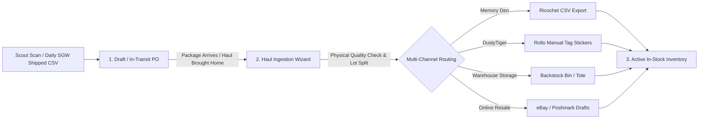
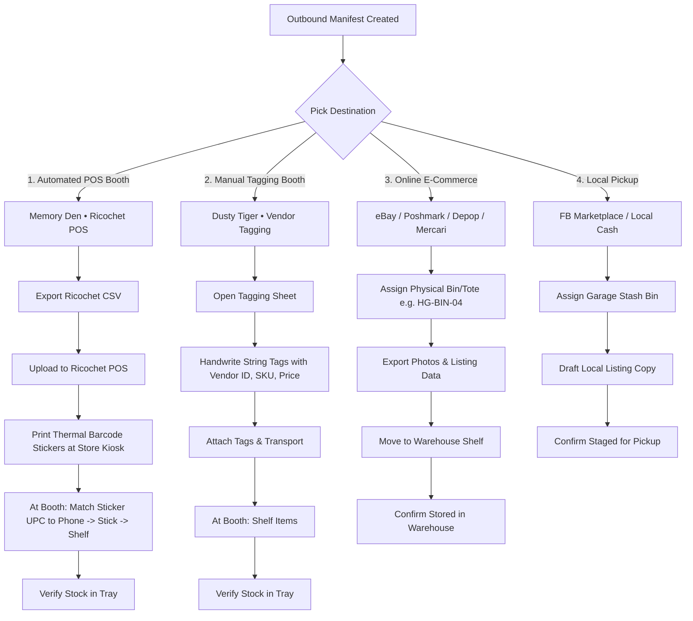

# Haul Ingestion & Multi-Channel Sourcing SOP

## 1. User Sourcing Channels & Sourcing Persona
1. **In-Person Thrift Runs (Goodwill, Estate Sales, Garage Sales)**:
   - Sourced via live camera receipt OCR in **Speed Entry** (`/purchases/speed-entry`).
   - Generates a Purchase Order with raw line items and costs.
2. **Daily Online Auction Shipments (ShopGoodwill, eBay, HiBid)**:
   - Imported via daily **Shipped Report CSVs** into Purchase Orders (`status: 'ordered'` or `'in-transit'`).
   - Tracks tracking numbers, purchase dates, and landed shipping/handling allocations.
3. **Co-Op & Shared Booth Operations (PDXGL "Portland Gaming Library")**:
   - Manages personal inventory alongside shared booth co-founders (e.g. PDXGL) with segregated inventory ownership and partner consignment reconciliation.

---

## 2. The 4-Stage ERP Lifecycle (Zero Inventory Clutter)

```mermaid
flowchart LR
    A[Scout Scan / Daily SGW Shipped CSV] --> B[1. Draft / In-Transit PO]
    B -->|Package Arrives / Haul Brought Home| C[2. Haul Ingestion Wizard]
    C -->|Physical Quality Check & Lot Split| D{Multi-Channel Routing}
    D -->|Memory Den| E[Ricochet CSV Export]
    D -->|DustyTiger| F[Rollo Manual Tag Stickers]
    D -->|Warehouse Storage| G[Backstock Bin / Tote]
    D -->|Online Resale| H[eBay / Poshmark Drafts]
    E & F & G & H --> I[3. Active In-Stock Inventory]
```

### Stage Rules:
- **Rule 1: Never Clutter Active Inventory**: Items in `draft`, `ordered`, or `in-transit` status must **NEVER** appear in the main active inventory table. They reside exclusively in **Purchases** (`/purchases`).
- **Rule 2: Pre-Arrival Intelligence**: While an online auction order is in-transit, Gemini AI pre-identifies items from the auction photos, pre-calculates target margins, and drafts 30–42 character tag titles.
- **Rule 3: Unboxing Verification & Lot Splitting**:
  - When the physical box arrives, the user opens the **Haul Ingestion Wizard**.
  - High-ticket "grail" items are split out as individual single SKUs ($35–$150+).
  - Mid-tier runs are combined into multi-quantity SKUs ($12–$25/ea).
  - Common/filler copies are bundled into grab-bags or floor bins ($4–$8/ea).
- **Rule 4: Multi-Channel Destination Routing**:
  1. **Memory Den**: Exports 1-Click **Ricochet POS CSV** (`SKU, Item Title, Description, Price, Quantity, Category, Brand`) to upload and print in Ricochet POS.
  2. **DustyTiger**: Prints direct **Rollo Thermal Stickers** (`DUSTY`, Title, Price, SKU) to stick directly onto DustyTiger's manual cardstock tags.
  3. **Backstock Storage**: Assigns physical storage bin/tote (e.g. *Bin A1, Tote 4*) for items waiting for booth shelf space.
  4. **Online Marketplaces (eBay/Poshmark)**: Generates 80-char SEO titles, condition notes, keywords, and market comps.

---

## 3. Physical Thermal Label & Tag Standards (Rollo & Ricochet)
- **Memory Den Tag Titles**: Strictly 30–42 characters max for thermal price tag compatibility:
  - *Vintage Magazines*: `Heavy Metal Mag - Oct 1977 #7`
  - *Vintage Apparel*: `Carhartt Detroit Jacket (L)`
  - *Toys/Figures*: `Kenner Star Wars Boba Fett 1979`
  - *Music/Media*: `Def Leppard Rock of Ages (2-CD)`
- **Multi-Disc Sets**: A 2-CD or double LP set is **1 single inventory SKU**, not 2 separate items.

---

## 4. Outbound Manifest & Destination Routing SOP

When inventory is ready to leave the workbench/staging area, it is grouped into an **Outbound Manifest**. The operational workflow adapts strictly to the destination archetype:

### The 4 Destination Archetypes:

```mermaid
flowchart TD
    M[Outbound Manifest Created] --> L{Pick Destination}
    L -->|1. Automated POS Booth| MD[Memory Den • Ricochet POS]
    L -->|2. Manual Tagging Booth| DT[Dusty Tiger • Vendor Tagging]
    L -->|3. Online E-Commerce| ON[eBay / Poshmark / Depop / Mercari]
    L -->|4. Local Pickup| FB[FB Marketplace / Local Cash]

    MD --> MD1[Export Ricochet CSV] --> MD2[Upload to Ricochet POS] --> MD3[Print Thermal Barcode Stickers at Store Kiosk] --> MD4[At Booth: Match Sticker UPC to Phone -> Stick -> Shelf] --> MD5[Verify Stock in Tray]
    
    DT --> DT1[Open Tagging Sheet] --> DT2[Handwrite String Tags with Vendor ID, SKU, Price] --> DT3[Attach Tags & Transport] --> DT4[At Booth: Shelf Items] --> DT5[Verify Stock in Tray]

    ON --> ON1[Assign Physical Bin/Tote e.g. HG-BIN-04] --> ON2[Export Photos & Listing Data] --> ON3[Move to Warehouse Shelf] --> ON4[Confirm Stored in Warehouse]

    FB --> FB1[Assign Garage Stash Bin] --> FB2[Draft Local Listing Copy] --> FB3[Confirm Staged for Pickup]
```

---

## 5. The In-Store "Sticker & Shelf" Physical Protocol (Memory Den)

Because thermal barcode label printers are located on-site at the consignment mall (not at the home garage), the in-store stocking flow follows a strict physical sequence:

1. **Pre-Arrival (Home/Office)**:
   - Items staged into a destination drop manifest in Resale Command.
   - 1-Click Ricochet CSV exported and imported into Ricochet POS.
   - Items packed into tote bins and driven to the store.
2. **Kiosk Check-In (Front Desk)**:
   - User accesses the shop's thermal label printer and prints the freshly imported batch of adhesive barcode stickers.
   - User enters their booth holding a printed strip/sheet of thermal stickers and the un-stickered items.
3. **Booth Stocking & Verification (Phone UI)**:
   - User opens Resale Command on mobile and slides open the **Manifest Tray**.
   - **Visual & SKU Matching**: The Tray highlights the **UPC / SKU** in high-contrast bold font alongside the photo thumbnail and retail price.
   - **Stick & Shelf**: User matches the sticker barcode to the phone screen, sticks it onto the physical item, and places it onto the shelf.
   - **One-Tap Checkoff**: User taps the item row to mark it verified (turns green/struck through).
   - **Mid-Stock Adjustments**: If a flaw or chip is spotted on an item, tapping the edit icon opens the `ItemDrawer` to adjust the price or condition immediately.
   - **Commit**: Tapping **`Confirm Stocked`** marks all checked items as `status: 'placed'` at `storageLocation: 'MD'` and archives the manifest to history.

---

## 6. Single True UPC Authority & Anti-Desync Invariants

To permanently eliminate barcode desynchronization, duplicate tag collisions, and missing UPCs:

### A. The Single Source of Truth (`src/lib/upcAuthority.ts`)
- **Strict Invariant: Zero Ghost Barcodes**:
  - The CSV exporter, lot splitter, and haul wizards must **never** slice arbitrary characters from Appwrite document IDs or invent unpersisted barcodes.
  - Every exported or printed barcode must exist as a persisted `upc` attribute in Appwrite `resale_db.items`.
  - When an export is initiated in `useManifest.ts`, `ensureItemUpc()` scans all staged items and writes true canonical sequential UPCs to any unassigned items in the database before generating the CSV.
- **Prefix Isolation & True Database Max**:
  - Barcodes follow strict org prefixes (e.g., `HUCK-` for Memory Den booth items, `PDX-` for Portland Gaming Library co-op).
  - New numbers are computed by querying the true maximum integer suffix across the entire collection (`getTrueMaxUpcIndex()`), completely preventing collisions caused by local 50-item query limits.

### B. Ricochet Confirmation Loop (Patch B: `src/lib/manifestReconciliation.ts`)
- When an outbound CSV is uploaded to Memory Den's Ricochet POS (`memoryden.ricoconsign.com`), Ricochet assigns internal store inventory identifiers (e.g. `0EJ993444`).
- **Return Dropzone**: The locked/in-transit `LocationManifestTray.vue` provides a 1-click **"Ricochet Booth SKUs"** dropzone.
- Dropping Ricochet's confirmation CSV matches records by exact UPC (`HUCK-xxxx`) or normalized Title + Price, updating `locationSku` on both the live Appwrite item and the manifest snapshot.
- Both the drawer header and the manifest tray display high-visibility badges: `UPC: HUCK-1488` and `DEN: 0EJ993444`.

### C. Direct Rollo Thermal Printing (Mac & PC At-Home Protocol)
- **Why Direct Printing**: Ricochet's web app uses Windows-centric print handlers that often distort margins or break continuous label feeds on macOS.
- **Resale Command Thermal Engine (`src/lib/rolloLabelPrint.ts` & `src/lib/barcode128.ts`)**:
  - Uses zero-dependency, pure SVG vector Code 128 barcode rendering with zero DPI blur.
  - Leverages pure CSS `@page { size: ...; margin: 0; }` continuous feed directives.
  - Supports standard thermal media sizes:
    - `2" x 1"` (Compact booth shelf stickers)
    - `2.25" x 1.25"` (Standard jewelry/apparel hangtag stickers)
    - `4" x 6"` (Large bin/shipping labels)
  - Eliminates booth kiosk waiting by enabling full pre-stickering at home before transport.

### D. Clean UI Architecture Invariant
- **No Treatment for Unused Code**: Never render visual UI elements, buttons, badges, stubs, or placeholder controls for features that are dead, unhooked, or incomplete. 
- Component templates must remain tight, modular, and fully functional, delegating business logic to clean reusable services (`upcAuthority.ts`, `manifestReconciliation.ts`, `rolloLabelPrint.ts`).

### E. Scratch Scripts vs. Repository Tooling Invariant
- **Never Place Temporary Scripts in `scripts/`**: The `scripts/` directory is reserved exclusively for permanent, production repository tooling (such as `validate-templates.mjs` and schema auditing).
- **All Diagnostic / Ad-Hoc Scripts Belong in `scratch/`**: The root `scratch/` directory is permanently ignored by `.gitignore`. Any exploratory queries, one-off diagnostic scripts, or throwaway migration checks must always be created inside `scratch/`.

