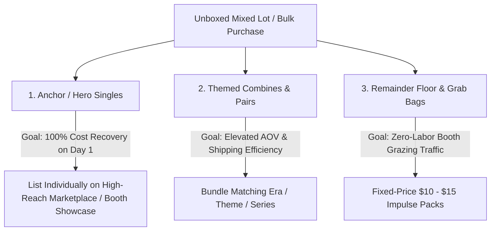

# Lot Profit & Exit Strategy Standard Operating Procedure (SOP)

This standard codifies the business heuristics, financial math, and operational workflows for extracting maximum profit from bulk lots, mystery boxes, mixed estate collections, and bulk inventory acquisitions in Resale Command.

---

## 1. The Core Philosophy: The Exit Playbook

When an item is purchased, the reseller mindset transitions from **Evaluation** (*"Should I buy this?"*) to **Execution** (*"What is the exit playbook to turn this physical inventory into cash with maximum margin and minimum labor?"*).

A bulk lot should almost **never** be flipped as a single bulk auction unless it is low-margin filler. Slicing a lot into disciplined tiers typically yields **+40% to +80% higher net profit** while dramatically lowering capital risk.

---

## 2. The 4-Tier Exit Heuristics

### Heuristic 1: The Anchor / Break-Even Hero (Cost Recovery)
* **Definition**: The 1 or 2 standout, high-demand, high-liquidity pieces in the collection (e.g. key vintage RPG module, rare character figure, first edition, holofoil, designer garment).
* **The Rule**: Price the hero piece(s) to recover **80% to 120% of the entire lot's landed cost basis**.
* **Why**: Once the hero item sells, the reseller has achieved **100% capital break-even**. The initial cash outlay is safely back in the bank, and **every single remaining item in the lot represents pure profit**.
* **Target Channel**: High-reach online marketplace (eBay / Poshmark) or locked antique mall showcase (Memory Den Showcase).

### Heuristic 2: Themed / Synergy Combines (Basket Size Leverage)
* **Definition**: Complementary items grouped into volume packs or companion sets (e.g. 2 troop-builder action figures, 3 fantasy paperbacks by the same author, matching hat + accessory).
* **The Rule**: Combine like-with-like or thematic companions to target **$25 – $45 sweet-spot price points**.
* **Why**: Avoids the "Single-Item Shipping & Listing Trap." Listing a $6 item individually on eBay costs $4.50 in shipping, $1.50 in fees, and 15 minutes of photography/packing—yielding pennies. Combining 3 into a $28 bundle costs the exact same labor and shipping while netting $18+ clean profit.
* **Target Channel**: Online bundle or boutique shelf display.

### Heuristic 3: Floor Fillers & Grazing Runs (Velocity & Zero-Friction Turns)
* **Definition**: The low-ticket remainder items (e.g. common paperbacks, loose micro-figurines, minor accessories, generic pieces).
* **The Rule**: Batch into **$5, $10, or $15 flat-price grab bags, reader bundles, or mystery packs**.
* **Why**: Physical booth shoppers at antique malls love grazing through low-cost impulse baskets. Selling 10 micro-figurines as a single $12 grab bag clears inventory instantly with 1 barcode tag and 0 listing time.
* **Target Channel**: Antique mall floor baskets / bins (Memory Den / Dusty Tiger).

### Heuristic 4: Channel Routing by Weight & Velocity
* **Online (eBay / Poshmark / Etsy)**:
  * High-value, light-weight, rare, collectible pieces where national buyer density drives a premium.
  * Media Mail eligible items (books, RPG manuals, vinyl records).
* **Physical Booth (Memory Den / Dusty Tiger Ricochet POS)**:
  * Heavy, fragile, or bulky items that are cost-prohibitive to ship online.
  * Tactile goods (apparel, hats, vintage home decor, skulls, oddities).
  * Flat-price impulse items ($10 – $20) that turn fast without shipping overhead.

---

## 3. Financial Invariants & Split Math

1. **Strict Cost Basis Conservation**:
   $$\sum_{i=1}^{n} \text{Allocated Child Cost}_i = \text{Parent Lot Landed Cost}$$
   *When splitting out child items in the Lot Splitter, never create or destroy cost basis out of thin air.*

2. **Projected Yield Math**:
   $$\text{Bulk Liquidation Value} < \text{Sliced Playbook Value}$$
   *Always calculate and present the estimated upside of the sliced strategy vs. flipping as an untouched bulk box.*

---

## 4. UI Standards in Resale Command

* **Tab Naming**: The tab representing lot strategy and provenance is titled **`Playbook`**.
* **Lifecycle Guardrail**:
  * Unacquired items (`status !== 'acquired'`): **Speed Scout AI only**.
  * Acquired items (`status === 'acquired'`): **AI Deep Scan & Profit Playbook unlocked**.
* **Acquisition Audit Preservation**:
  * Original pre-buy advice (`BUY_NOW`, `max_bid`) is locked into a collapsible **`🔒 Original Pre-Buy Sourcing Audit`** card within the `Playbook` tab so tax/provenance records remain intact.
