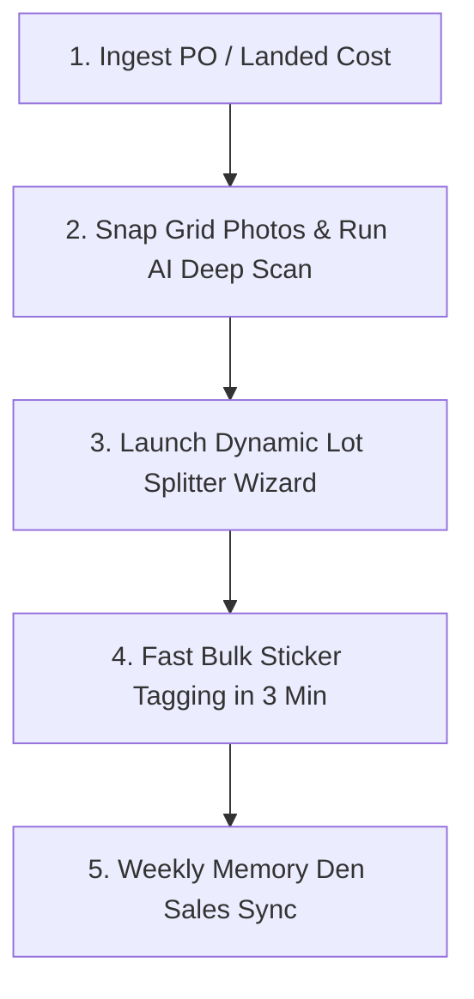

# Universal Physical Booth Operations & Multi-Item Lot Curation SOP

This standard operating procedure documents the end-to-end workflow for purchasing, inspecting, splitting, tagging, and synchronizing bulk lots across **all resale categories** (Magazines, Action Figures, Miniatures, Model Airplanes, Die-Cast, Video Games, Apparel) with physical antique mall booths (**Memory Den**) in **Resale Command**.

---

## 1. Universal Multi-Category Merchandising

This framework applies universally across any bulk lot:

| Category | 🌟 Tier 1: Standout Keys (Single High-Ticket) | 📦 Tier 2: Mid-Tier Runs (Multi-Qty Bulk SKU) | 🛒 Tier 3: Floor / Reader / Parts (Impulse & Grab-Bags) |
| :--- | :--- | :--- | :--- |
| **Action Figures & Toys** | Rare Grail / Complete Figures (Boba Fett, Mint on Card) @ $45–$150+ | Loose Complete Figures @ $12–$18/ea (Multi-Qty Qty: 25) | Beater Figures / Incomplete / Parts Bins @ $4–$6/ea |
| **Miniatures & Tabletop** *(Warhammer, D&D)* | Rare OOP Lead Characters / Pro-Painted HQ Units @ $35–$80+ | Standard Squad Units @ $8–$14/ea (Multi-Qty Qty: 40) | Unpainted Sprues / Bits Box / Grab-Bags @ $5/ea |
| **Model Airplanes & Die-Cast** | Mint-in-Box 1:72 Diecast Bombers / Rare Liveries @ $45–$120+ | Loose Complete Display Fighters @ $15–$25/ea (Multi-Qty) | Minor Flawed / Scratch-and-Dent / Parts @ $6–$8/ea |
| **Vintage Magazines / Comics** | Key Issues (Oct 1977 Tim Leary, #1s, Moebius/Frazetta covers) @ $35–$65+ | 80s/90s Complete Runs @ $14–$20/ea (Multi-Qty Qty: 30) | Reader Copies / Floor Bins @ $6–$8/ea or 3-Packs |
| **Video Games & Cartridges** | CIB Rare RPGs / 1st Party Classics @ $40–$100+ | Loose Popular Cartridges @ $15–$25/ea (Multi-Qty Qty: 30) | Sports Games / Filler / As-Is Discs @ $3–$5/ea |
| **Vintage Apparel & Denim** | Selvedge / Big E / Carhartt Detroit / 90s Tees @ $45–$150+ | Standard Flannels / Vintage Western Shirts @ $18–$28/ea | Clearance Rack / Minor Stain Bargains @ $8–$12/ea |

1. **Immutable PO Cost Basis**:
   - The original landed purchase cost from the supplier/auction invoice (PO) is **immutable and locked**.
   - When a master lot is deconstructed, the sum of child unit costs must reconcile 100% to the original PO cost.
   - The master lot's original cost is never zeroed out or corrupted.

2. **Every Child Item Retains Full Lineage**:
   - Every split item (single, multi-quantity SKU, or bundle) must retain:
     * `purchaseId` $\to$ Link to original Purchase Order
     * `orderId` $\to$ Link to original sourcing order/invoice
     * `parentLotId` $\to$ Link to the master lot document

3. **Multi-Quantity vs. Single Item Merchandising**:
   - High-ticket key items are split into **Individual Singles** (for bagged & boarded showcase display).
   - Mid-tier runs and reader copies are split into **Multi-Quantity SKUs** (Qty: N @ $X.XX/ea) so the seller only creates 1 listing in Memory Den POS and prints identical bulk stickers.

---

## 2. Standard 5-Step Operating Procedure (Golden Path)

### Step 1: Purchase Order (PO) Ingestion
- Upload the ShopGoodwill invoice CSV or use **Speed Entry** to log the purchase.
- Total landed invoice cost (item + tax + shipping) is permanently anchored as the cost basis.

### Step 2: Parallel AI Inspection
- Lay out items in 2–4 grid overview photos (15–20 items per photo).
- Tap **`⚡ AI Deep Search`** $\to$ Google Gemini scans covers in parallel, transcribes artist/feature blurbs (*Moebius, Frazetta, Tim Leary, Frezzato*), and creates the catalog list.

### Step 3: Dynamic Lot Splitter Wizard (`⚡ Deconstruct Lot`)
- Launch the **Lot Splitter Wizard**.
- Configure N-Tiers:
  * **🌟 Tier 1: Standouts / Keys** $\to$ `Single Items` mode ($35 – $65+ each).
  * **📦 Tier 2: Mid-Tier Runs** $\to$ `Multi-Qty SKU` mode ($16.00/ea, Qty: N).
  * **🛒 Tier 3: Floor Readers** $\to$ `Multi-Qty SKU` mode ($8.00/ea, Qty: N) or `Bundled Set` mode.
- Use mobile 1-tap pills to reassign items if needed.
- Select cost allocation (Equal Split or Value-Weighted).
- Click **`Create SKUs`**.

### Step 4: Physical Booth Stocking & Rapid Tagging
- For Tier 2 and Tier 3, create **1 listing per tier** in Memory Den software.
- Print identical bulk barcode stickers (e.g. 30x $16 stickers).
- Tag entire stack in 2–3 minutes.
- For Tier 1 keys, tag individually with custom barcode labels for the locked glass showcase.

### Step 5: Sales Reconciliation & Inventory Sync
- Upload weekly Memory Den sales payout CSV via **Sales Importer**.
- Memory Den register sales automatically decrement multi-quantity inventory quantities (e.g. 30 $\to$ 26) and mark sold singles as `Sold`.
- Exact profit margins and net payouts (after the 12% booth commission) are calculated and recorded automatically.
