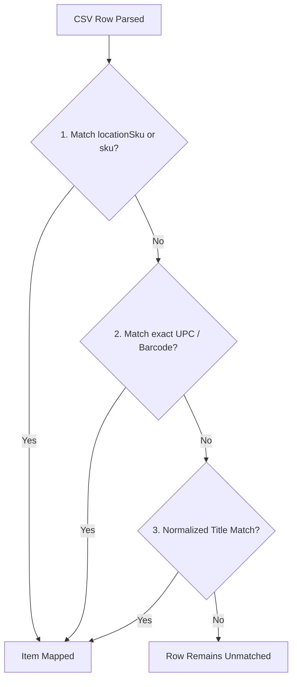

# Location Sync & Consignment Mapping Guide

The **Location Sync Workspace** (`/warehouse/sync`) allows you to import external product exports and payout reports (such as Memory Den or other antique mall consignment booths) to reconcile inventory, attribute sales, auto-calculate take-home payouts after booth fees, and export two-way barcode tags with UPCs.

---

## 1. How CSV Columns Map to ResaleCommand

When you upload a CSV export, ResaleCommand automatically scans the header row (case-insensitive) to map columns into internal fields:

| CSV Column Variations Detected | Internal Property | Target Appwrite Field | Description / Purpose |
| :--- | :--- | :--- | :--- |
| `Product ID`, `SKU`, `Location SKU`, `Custom SKU`, `Barcode` | `extractedSku` | `items.locationSku` | Booth/Consignment SKU tag (e.g., `0931-15`, `0EJ066`). Also extracted from item title suffixes like `"Item Name - 0EJ066"`. |
| `Name`, `Item`, `Title`, `Product Name` | `itemName` | `items.title` | Full item name from external booth. |
| `Agreed Price`, `Aged Price`, `Price`, `Total` | `listedPrice` | `items.resalePrice` | **Sticker / Gross Retail Price** placed on the item in the physical booth (e.g., `$200.00`). |
| `Split / Cost`, `Consignor %`, `Consignor Percent` | `consignorPct` | Calculated split | Consignor payout percentage (e.g., `85%` payout means the booth retains a `15%` commission fee). Defaults to warehouse's configured commission rate if omitted. |
| `Amount`, `Final Amount`, `Sold Amount`, `Payout`, `Net Amount` | `netSoldPrice` | `items.soldPrice` | **Net Take-Home Payout** you made after booth commission fees (e.g., `$200 * 85% = $170.00`). |
| `Inventory`, `Status` | `status` | `items.status` | Detects whether item is `'instock'` or `'sold' / 'paid'`. |

---

## 2. Consignment Math: Gross vs. Net Take-Home

Consignment malls typically charge a commission percentage on each sold item. ResaleCommand handles this math automatically:

```
Listed Agreed Price (Gross):   $200.00  -->  item.resalePrice
Consignor Split:                   85%  (Booth retains 15%)
Booth Commission Fee:           $30.00  -->  sales.commissionFee
--------------------------------------------------------------
Net Made (Take-Home Payout):   $170.00  -->  item.soldPrice & sales.netPayout
```

### Calculation Rules:
1. **If explicit `Amount` column exists and differs from `Agreed Price`**: ResaleCommand treats `Amount` as the exact settled payout.
2. **If `Amount` is identical to `Agreed Price` (or missing)**: ResaleCommand applies the consignor split percentage:
   $$\text{Net Sold Price} = \text{Agreed Price} \times \left( \frac{\text{Consignor \%}}{100} \right)$$
3. **Commission Fee logged in Sales collection**:
   $$\text{Commission Fee} = \text{Gross Agreed Price} - \text{Net Sold Price}$$

---

## 3. Inventory Auto-Matching Priority

When a CSV is loaded, ResaleCommand attempts to link each CSV row to an existing item in your ResaleCommand active inventory using a 4-tier matching sequence:



1. **Tier 1: Location SKU Match**: Matches `extractedSku` against `item.locationSku` or `item.sku`.
2. **Tier 2: UPC / Barcode Match**: Matches `extractedSku` against `item.upc`.
3. **Tier 3: Normalized Title Match**: Strips punctuation and spaces from both the CSV title and inventory title for an exact alphanumeric match.
4. **Manual Search / Override**: For any unmatched row, users can type in the inline search bar to search inventory by title, UPC, or SKU and click to bind.
5. **Quick Add / Bulk Quick Add**:
   - Single item: Click `+ Quick Add` to instantly generate an inventory item with the next sequential `HUCK-XXXX` barcode.
   - Bulk: Click `Quick Add All Unmatched (N)` banner to create all missing items at once.

---

## 4. What Happens During "Sync & Commit"

When you click **Sync & Commit Items**, ResaleCommand updates the backend database:

### A. Appwrite `items` Collection Updates:
- `locationSku`: Stamped with the booth's SKU tag.
- `sellingLocations`: Appends the booth/warehouse location name to the item's active selling channels array (e.g. `["Memory Den", "eBay"]`).
- `status`:
  - If sold in CSV: Set to `'sold'`.
  - If in stock in CSV and currently `'scouted'` / `'received'`: Set to `'placed'`.
- `resalePrice`: Stamped with the gross sticker price (e.g., `"$200.00"`).
- `soldPrice`: Stamped with the exact net take-home dollar amount (e.g., `170.00`).
- `saleId`: Linked to the created `sales` document ID.

### B. Appwrite `sales` Collection Updates (for Sold Items):
A formal sales record is created:
```json
{
  "soNumber": "SO-00042",
  "warehouseId": "68a3f89000123456789a",
  "orderId": "0931-15",
  "saleDate": "2026-08-17T12:00:00.000Z",
  "status": "Sold",
  "grossAmount": 200.00,
  "commissionFee": 30.00,
  "shippingCharged": 0,
  "shippingCost": 0,
  "netPayout": 170.00,
  "tenantId": "team_alpha"
}
```

---

## 5. Two-Way CSV Export with Barcodes / UPCs

When the **"Download Synced CSV with UPCs"** checkbox is enabled (default), committing the sync automatically downloads a modified version of your original CSV file:
- An extra `"UPC"` column is appended (or updated if already present).
- Every mapped or quick-added row contains its corresponding ResaleCommand barcode (e.g., `HUCK-0931`).
- You can re-upload this CSV into Memory Den or your booth label software to print barcode stickers matching your internal ResaleCommand inventory tags.

---

## 6. Example Walkthrough

### Example Input CSV (`MemoryDen_Payout.csv`):
```csv
Product ID,Name,Split / Cost,Agreed Price,Amount,Status
0931-15,Vintage MCM Walnut Chair - 0931-15,85%,150.00,127.50,Sold
0931-16,Cast Iron Dutch Oven,85%,60.00,51.00,Sold
0931-17,Brass Floor Lamp - 0931-17,85%,95.00,0.00,In Stock
```

### Result in ResaleCommand:
1. **MCM Walnut Chair**:
   - `resalePrice`: `$150.00` (Agreed Sticker Price)
   - `soldPrice`: `$127.50` (Net Take-Home)
   - `status`: `'sold'`
   - `locationSku`: `0931-15`
   - Sales Record created with `$22.50` commission fee deduction.
2. **Cast Iron Dutch Oven**:
   - `resalePrice`: `$60.00`
   - `soldPrice`: `$51.00`
   - `status`: `'sold'`
3. **Brass Floor Lamp**:
   - `resalePrice`: `$95.00`
   - `soldPrice`: `undefined`
   - `status`: `'placed'` (Active in booth)
