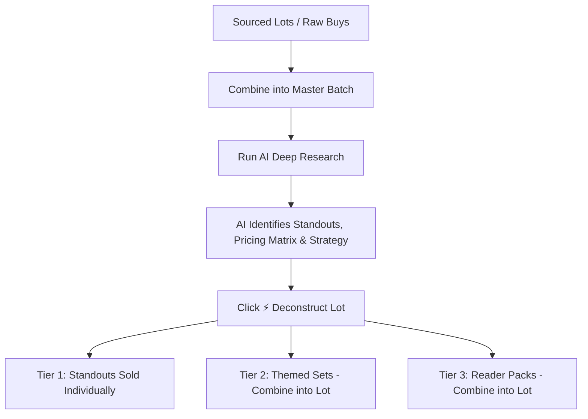

# Multi-Item Lot Curation & AI Inspection Guide

This guide documents the end-to-end workflow for sourcing, inspecting, deconstructing, and curating multi-item lots (magazines, books, clothing bundles, video games, toys, tech, and collectibles) to maximize profitability across physical retail booths (e.g., Memory Den, DustyTiger) and online marketplaces (eBay, Poshmark, Mercari).

---

## 1. The Reseller Curation Philosophy

When buying lots in bulk from thrift stores, estate sales, or online auctions (e.g., ShopGoodwill), selling the entire lot as a single bulk bundle often leaves significant money on the table. 

By combining raw acquisitions into a master lot, running **AI Deep Research** to catalog all pieces, and re-curating them into strategic pricing tiers, you capture maximum collector value on rare pieces while maintaining high inventory turnover on reader copies.

---

## 2. The 3-Tier Profitability Grouping Strategy

The Resale Command AI inspection engine automatically evaluates every lot against this 3-tier merchandising framework:

| Pricing Tier | Item Classification | Pricing Target | Merchandising & Display Strategy |
| :--- | :--- | :--- | :--- |
| **🌟 Tier 1: Standout Keys & Rare Issues** | Premiere #1 issues, iconic cover artists (Moebius, Giger, Frazetta, Olivia, Corben), 1st printings, designer vintage (Carhartt Detroit, Levi's Made in USA, Pendleton). | **$25.00 – $65.00+ each** | **Bag & Board individually** with premium tags for booth showcase or individual high-value eBay listings. |
| **📦 Tier 2: Mid-Tier Collectibles & Themed Sets** | Solid 80s/90s run issues, complete author trilogies (*Dragonlance Chronicles*, *Icewind Dale*), recognizable brand apparel. | **$12.00 – $22.00 each** (or **$35.00 – $60.00 / set**) | Display individually on booth shelves or bundle into **2–3 issue themed collector sets**. |
| **🛒 Tier 3: Reader Copies & Value Bundles** | High-print common issues, mild wear reader copies, everyday basics. | **$24.00 – $45.00 / bundle** ($6.00 – $8.00 / unit) | Bundle into **3–6 piece grab-bags / multi-packs** to drive fast volume turnover in the booth. |

---

## 3. Step-by-Step Curation Workflow in Resale Command

### Step 1: Ingest & Combine Raw Purchases
1. When receiving multiple small lots or auction wins, select them in the **Inventory Manager**.
2. Click **Combine into Lot** to create a single master lot record. This preserves your total landed purchase cost ($X.XX) and links all constituent photos.

### Step 2: Run AI Deep Research
1. Open the master lot in the **Edit Item Drawer**.
2. Ensure your photo gallery contains clear cover/front shots of each item.
3. Click the red **AI Deep Research** button (bottom left).
4. The multi-category inspection engine automatically:
   - Reads all visible text, dates, volume numbers, brand tags, and artist credits via OCR.
   - Merges multi-angle/spine/tag photos with their parent items to reflect the true physical quantity.
   - Highlights Standout Key Items (`is_key_issue: true`) with individual standalone valuations.
   - Delivers actionable merchandising advice for your physical booths and online channels.

### Step 3: Deconstruct the Master Lot
1. Review the **Bundle Components** list in the drawer.
2. Click **⚡ Deconstruct Lot** in the top-right of the Bundle Components card.
3. Resale Command automatically:
   - Deconstructs the master lot into separate active inventory documents.
   - Pro-rates and splits your base acquisition cost evenly across all items.
   - Assigns individual photos, titles, conditions, and estimated resale values.

### Step 4: Re-Curate into Sets and Packs
1. In your **Inventory Manager** list:
   - **Keep Standout Keys**: Leave Tier 1 items as single listings ready for their own high-dollar booth tags.
   - **Build Mini-Sets**: Select related items (e.g. 3 trilogy books or 2 artist issues) and click **Combine into Lot** $\to$ set price to **$35 – $55**.
   - **Build Value Bundles**: Select the remaining common reader copies and click **Combine into Lot** $\to$ set price to **$20 – $35**.

---

## 4. Multi-Category Trend Recognition Matrix

The inspection engine actively flags high-velocity resale trends across multiple categories:

* **Vintage Magazines & Comics**: Premiere #1 issues, cover artists (*Moebius, H.R. Giger, Frank Frazetta, Olivia De Berardinis, Richard Corben, Boris Vallejo*), out-of-print special editions.
* **Fantasy, RPGs & Books**: TSR 1st Editions, D&D 3.5e rare supplements, *Frank Herbert Dune* early prints, *Dragonlance / Forgotten Realms* 1st printings, *Shadowrun* cyberpunk classics.
* **Vintage & Heritage Apparel**: *Carhartt* (Detroit, Double-Knee, Aztec/Santa Fe), *Levi's* (Made in USA, Big E, Orange Tab 501/517), *Patagonia* (Synchilla, Deep Pile, Retro-X), *The North Face* (Nuptse 700, Mountain Light Gore-Tex), *Pendleton* (100% Virgin Wool), *Champion* Reverse Weave.
* **Contemporary & Alt Brands**: *Free People*, *Reformation*, *Lululemon*, *Dôen*, *Tripp NYC*, *Lip Service*, *Demonia*, *Dr. Martens (Made in England)*.
* **Electronics & Collectibles**: 35mm cameras (*Canon AE-1, Olympus Mju*), *Sony Walkmans*, retro gaming cartridges (*NES, SNES, N64*), LEGO collector sets.

---

## 5. Storage & Safe Mode Integrity

* **Full Valuation Storage**: Detailed AI scout data, market comps, and individual pricing matrices are preserved in `rawAnalysis`.
* **Safe String Truncation**: Summaries in `conditionNotes` are automatically bounded to Appwrite's 800-character attribute limits without data loss.
* **Image Management**: Temporary and cropped photo previews are automatically assigned to their respective component documents upon deconstruction.
